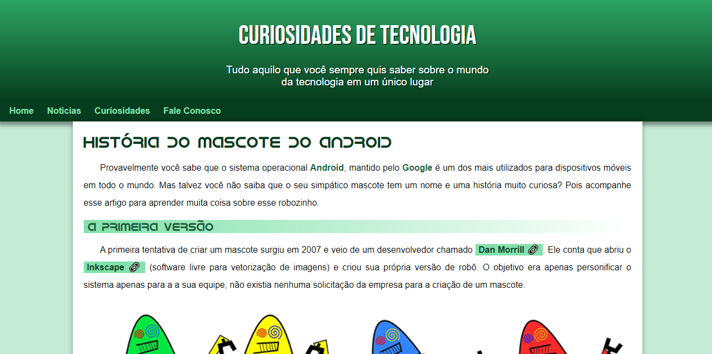
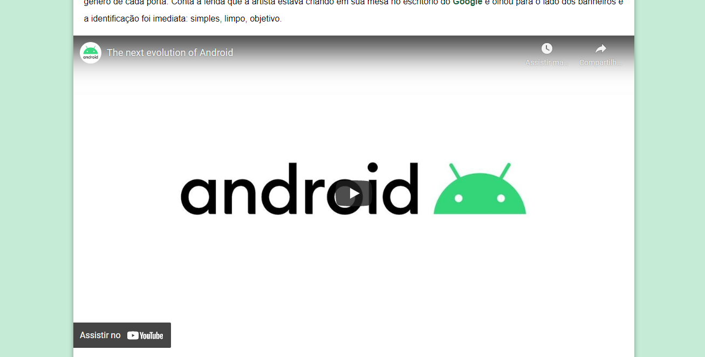
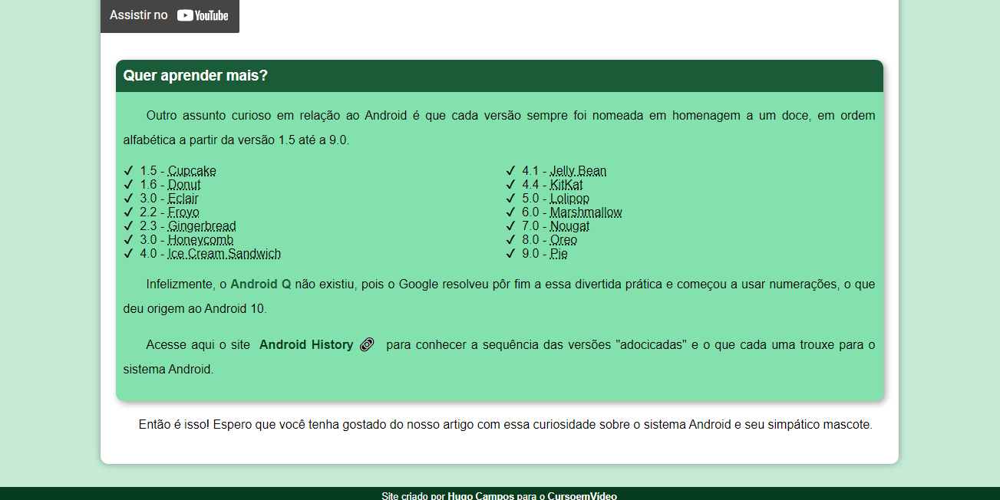
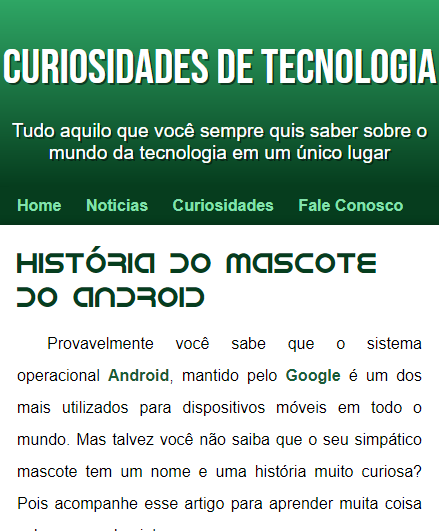
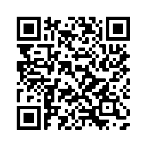

# 🖐 Olá, tudo bem? 
Esse e um projeto criado no CursoemVídeo de um exemplo de site resposivo e mais recentemente: como colocar o site no ar. 

### 📸 Algumas fotos do projeto par você: 

 
  
  
  
  

### Link do projeto para você conferir: <a href="https://hugocamposarimathea.github.io/projeto-android/" alt="Link do projeto">Clique aqui!</a>
### Ou então aponte a câmera do seu celular para o QR Code abaixo: 

### 📧 Quer entrar em contato comigo? Clique abaixo: 

 
   
 
 
